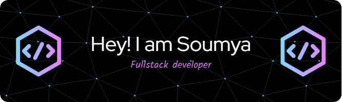

<h1 align='center'>👋 Hi, I’m Soumya Ranjan</h1>
<h3 align='center'>👀 I’m interested in Web-Devlopment & Cloud Computing</h3>
<h3 align='center'>💞️ I’m looking to collaborate on Webapplication Devlopment</h3>

## 🌐 Socials:
   

## 🤝🏽 Collaborate:

# 💻 Tech Stack:
                           
# 📊 GitHub Stats:
 

  

## 🏆 GitHub Trophies

### ✍️ Random Dev Quote

### 🔝 Top Contributed Repo

<!-- Proudly created with GPRM ( https://gprm.itsvg.in ) -->
<!---
IamGroot05/IamGroot05 is a ✨ special ✨ repository because its `README.md` (this file) appears on your GitHub profile.
You can click the Preview link to take a look at your changes.
--->
